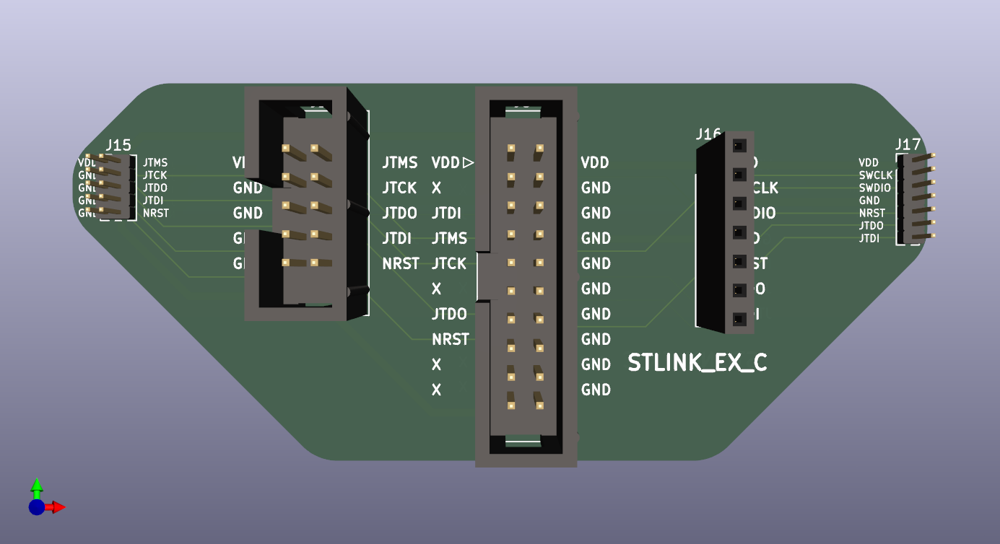
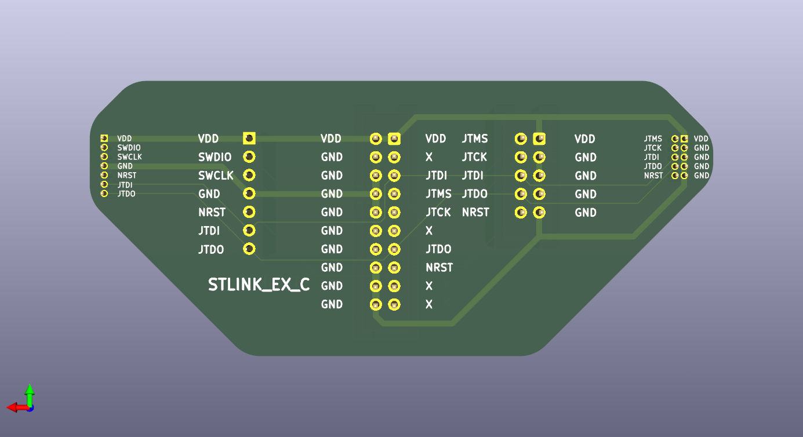
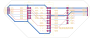

# stlink_ex_c

  
  
  

这是ST-LINK的转接板

stlink_ex_c: pin5 改为 pin7 , 改为VDD SWDIO SWCLK GND NRST JTDI JTDO

stlink_ex_b: 修改了板子的形状, 2x7 2x5 改为简易牛角接口, 丝印改到正确的位置

stlink_ex_a: JTGA 和SWD1.27mm间距和2.54mm间距